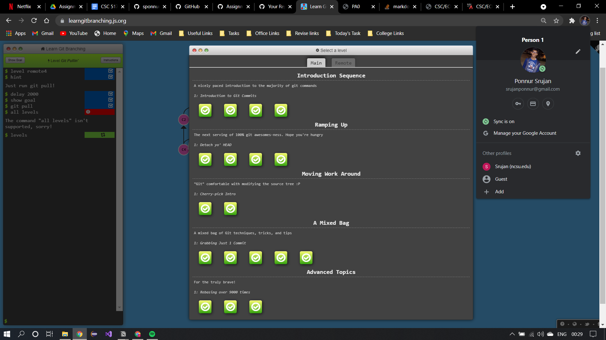

| Component | Possible Assignment Points |Partial Deductions(*full deduction taken if component is missing) | Assignment Points Earned |
| -------- |-----------------------------| ----------------------------------------------------------------|--------------------------/
| Component | Possible Assignment Points |Partial Deductions(*full deduction taken if component is missing) | Assignment Points Earned |

1. Create a private repo named CSC_ECE_517_Assignment_1
4 points
(–1) repo is public
(–1) repo name is not CSC_ECE_517_Assignment_1
4

2. Repo contains a README.md file
2 points
(–1) README is of different file type (ex: .txt)
2

3. Repo includes each of the following as Collaborators
2 points
(–1) yxiao28 is not included as a Collaborator
2

4. Created a private project named CSC_ECE_517_Assignment_1
4 points
(–1) project is public
(–1) project name is not CSC_ECE_517_Assignment_1
4

5. Repo contains a .png file named completedGitLevels
2 points
(–1) file extension of file is different than .png (ex: .jpg)
(–1) filename is not completedGitLevels
2

6. completedGitLevels.png has been embedded in the repo README
2 points
(–1) file is linked and not embedded in the README
2

7. Completed all 15 levels of the online git tutorial
15 points
(–1) for each level that is not completed
15

8. Project Board Issue #1
8 points
(–1) incorrect Label
(–1) incorrect Assignee
(–1) Description is does not accurately describe the issue/task
(–1) Issue did not move through the ToDo column
(–1) Issue did not move through the InProgress column
(–1) Issue did not move through the Done column
(–1) Issue is not closed
(–1) Issue not completed on time
8

9. Project Board Issue #2
8 points
(–1) incorrect Label
(–1) incorrect Assignee
(–1) Description is does not accurately describe the issue/task
(–1) Issue did not move through the ToDo column
(–1) Issue did not move through the InProgress column
(–1) Issue did not move through the Done column
(–1) Issue is not closed
(–1) Issue not completed on time
8

10. Project Board Issue #3
8 points
(–1) incorrect Label
(–1) incorrect Assignee
(–1) Description is does not accurately describe the issue/task
(–1) Issue did not move through the ToDo column
(–1) Issue did not move through the InProgress column
(–1) Issue did not move through the Done column
(–1) Issue is not closed
(–1) Issue not completed on time
8

11. Project Board Issue #4
11 points
(–1) incorrect Label
(–1) incorrect Assignee
(–1) Description is does not accurately describe the issue/task
(–1) Issue did not move through the ToDo column
(–1) Issue did not move through the InProgress column
(–1) Issue did not move through the Done column
(–1) Issue is not closed
(–1) Issue not completed on time
(–1) Headshot not appropriately updated
(–1) Email not appropriately updated
(–1) Name not appropriately updated
11

12. Project Board Issue #5
4 points
(–1) incorrect Label
(–1) incorrect Assignee

4

13. Completed Assignment Rubric embedded in README.md or included via markdown formatting.
2 Points
None
2

14. Pull request received with new file [unity.txt] requested to be merged into GitPractice_517_F20
2 Points
None
2

